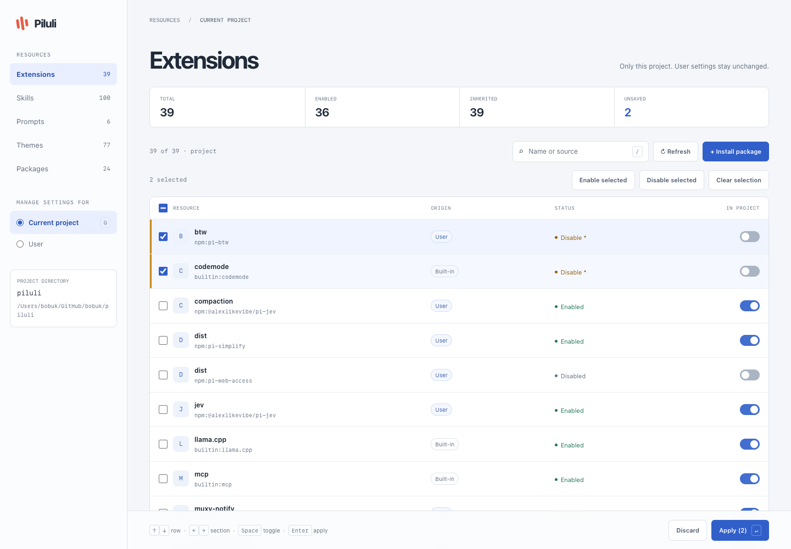

# 💊 Piluli / Pilulit

Two tiny resource managers for [Pi](https://pi.dev). **Piluli** opens in a browser. **Pilulit** stays in the terminal and pretends this was your idea.

One codebase, two standalone Python scripts, zero third-party dependencies.



## 🚀 Install

Requires Python **3.10+** and `pi` in `PATH` for package operations.

Choose your preferred dosage:

```sh
# Piluli — browser UI
curl -fsSL https://raw.githubusercontent.com/bobuk/piluli/main/install.py \
  | python3 - piluli

# Pilulit — terminal UI
curl -fsSL https://raw.githubusercontent.com/bobuk/piluli/main/install.py \
  | python3 - pilulit
```

The installer puts the selected script in the first usual local bin directory already on `PATH`: `~/.local/bin`, `~/bin`, or `~/.bin`. If none is on `PATH`, it uses `~/.local/bin` and politely tells you what to export.

Run both commands if you want both interfaces. Rerun one to update it. This is package management in the same sense that carrying a sandwich is catering.

## ✨ Use

From a project directory:

```sh
piluli     # opens http://127.0.0.1:5432
pilulit    # opens the curses TUI
```

Or point either interface elsewhere:

```sh
piluli --project-dir ~/code/my-project
pilulit --project-dir ~/code/my-project
```

Useful options shared by both:

```text
--project-dir PATH      Project root (default: current directory)
--scope project|user    Initial settings scope (default: project)
--agent-dir PATH        Pi directory (PI_CODING_AGENT_DIR or ~/.pi/agent)
--pi-command PATH       Pi executable (default: pi)
```

Web-only options:

```sh
piluli --no-browser --port 9000
```

The TUI needs an interactive terminal and stdlib `curses`, normally included on macOS and Linux. On Windows, take the browser pill.

## 🧰 What it manages

Both interfaces discover and manage:

- extensions;
- skills;
- prompts;
- themes;
- packages;
- user and project settings;
- built-in extensions and standalone resources.

You can search, switch scope, stage several changes, apply or discard them together, and install, update, or remove packages. Piluli also supports bulk selection in the browser because sometimes one checkbox is simply not enough bureaucracy.

A theme switch controls whether a theme file is available; it does not choose the active `theme` setting.

## 🎯 Scopes

| Scope | Settings file | Effect |
|---|---|---|
| **Current project** | `<project>/.pi/settings.json` | Only this project; user settings remain untouched |
| **User** | `~/.pi/agent/settings.json` | All projects; project overrides still win |

Project scope includes inherited user resources. You can disable one only for the current project, or explicitly enable something disabled for the user. Packages use Pi's native `autoload: false` overrides instead of reinstalling themselves for dramatic effect.

A saved switch is an explicit enable/disable, not “return to inheritance.” Your project must be trusted in Pi, and an already-running Pi session needs **`/reload`** after changes. Computers remain stubbornly literal.

## ⌨️ Keyboard controls

| Key | Piluli | Pilulit |
|---|---|---|
| `↑` / `↓` | Focus a row | Focus a row |
| `←` / `→` | Switch section | Switch section |
| `Space` | Toggle or select | Toggle resource |
| `Enter` | Apply | Apply |
| `/` | Search | Search |
| `G` | Switch scope | Switch scope (`Tab` too) |
| `R` | Refresh | Refresh |
| `X` | Discard | Discard |
| `I` | Install package | Install package |
| `u` / `U` | Package buttons | Update one / all |
| `D` | Remove package | Remove package |
| `Esc` | Close or leave search | Cancel or clear search |
| `Q` | — | Quit |
| `?` | — | Help |

Piluli keeps native `Tab` / `Shift+Tab` navigation. Pilulit uses your terminal's ANSI palette and keeps text markers in monochrome terminals, so even a terminal from the archaeological layer can participate.

## 📦 Package operations

Install, update, and remove happen immediately rather than through **Apply**. Save or discard staged resource changes first.

`pi update` is not scope-isolated, so Piluli reinstalls the configured source with `pi install` in the selected scope and preserves filters. Pinned versions stay pinned. Project operations use `--local --approve`; user operations use `--no-approve` without `--local`.

Only install sources you trust. Package installation may execute code with your permissions, which is a very efficient way for trust issues to become filesystem issues.

## 🔒 Local by design

- The web server binds only to loopback.
- Requests check `Host`, `Origin`, and a per-process API token.
- CSP blocks external scripts.
- Browsing resources does not execute them.
- Pi commands run without a shell or interactive stdin.
- Settings writes are atomic, revision-checked, and locked between Piluli/Pilulit instances.
- Existing permissions are preserved; writes through a `settings.json` symlink are rejected.

Do not expose the web port to a network. Piluli is a local tool, not a tiny SaaS business waiting to happen.

## 🛠️ Development

```sh
python3 src/piluli.py --no-browser
python3 src/pilulit.py
python3 build.py
```

The build produces two independent executables:

```text
src/piluli_core.py   shared discovery, scopes, filters, atomic writes, Pi CLI
src/piluli.py        HTTP server and API
src/pilulit.py       curses interface
web/                 browser interface
build.py             standalone builder
dist/piluli.py       standalone browser executable
dist/pilulit.py      standalone terminal executable
install.py           curl installer
tests/                standard-library tests and optional browser checks
```

Custom output paths:

```sh
python3 build.py --output ./piluli --tui-output ./pilulit
```

Run the checks:

```sh
python3 -m unittest discover -s tests -v
python3 -m py_compile install.py src/*.py dist/*.py
node --check web/app.js
```

Optional real-browser checks require `agent-browser`:

```sh
PILULI_BROWSER_TESTS=1 python3 -m unittest discover -s tests -p test_web.py -v
```

Tests use temporary directories, never your actual Pi settings. We have standards, even if our package manager is a Python file delivered through a pipe.

---

Take one Piluli after `/reload`. If symptoms persist, take Pilulit and enjoy the extra terminal. 😅
